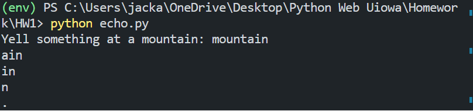
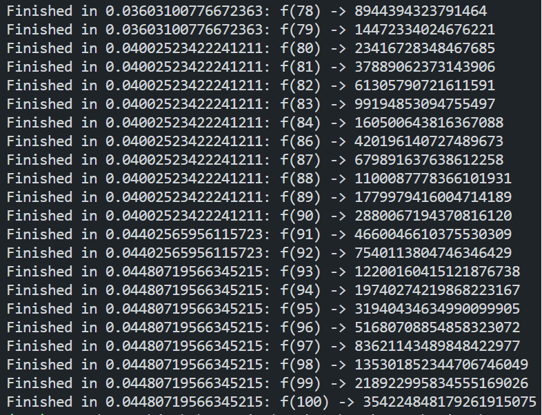
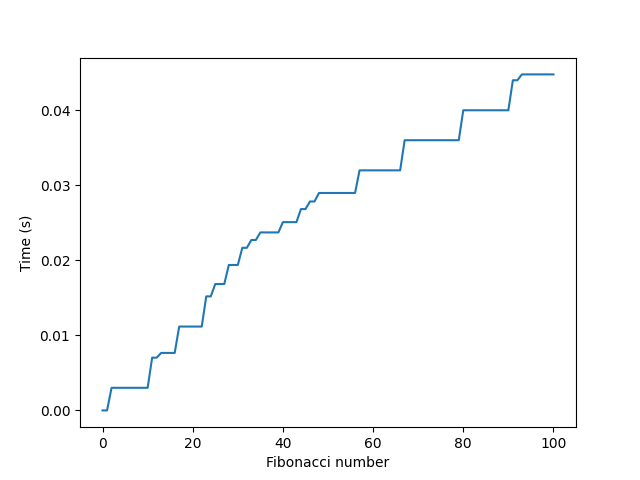

# Assignment Details

## echo.py

This file holds a function that imitates a real world echo by printing the last part of a word input by the user and slowing fading out over time.

An example of the output for this is shown here:

## fib.py

This file has three main components:

### Fibonacci function  

This function serves to calculate the nth fibonacci number in a recursive manner, using the lru_cache decorator to reduce compute time.

### Timing function 

This file also contains a timing decorator that runs the given function and prints out the time it takes it to run.

An example output of this for the fibonacci function is shown below:

*Note that these numbers might not match the numbers on the plot below due to coming from different runs of the program*

### Graph

The last part of this file is a function to make a plot for the time it takes to run the fibonacci function at different input values using the matplotlib library.

An example graph output:

